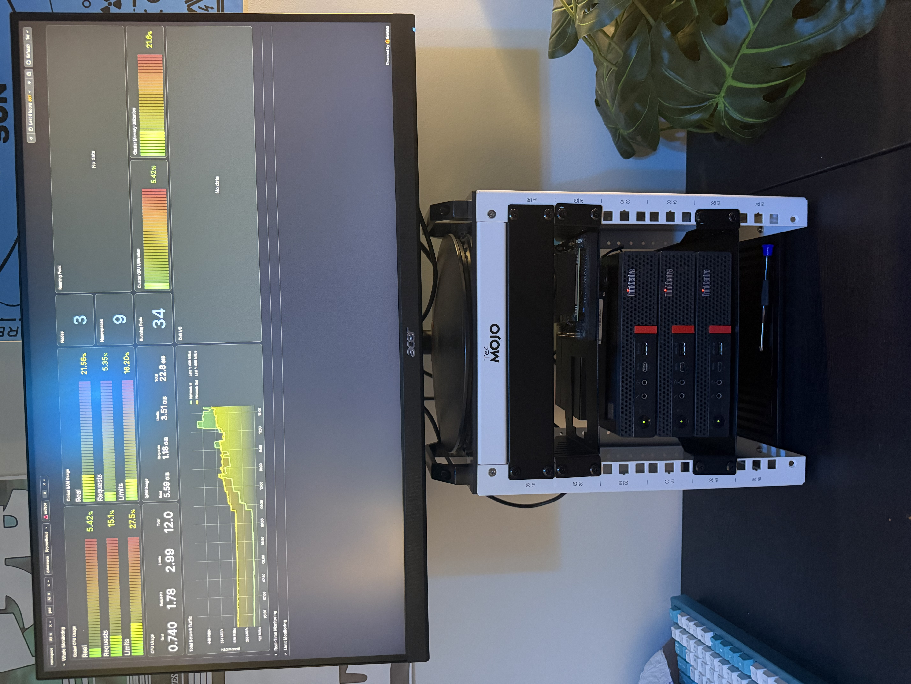
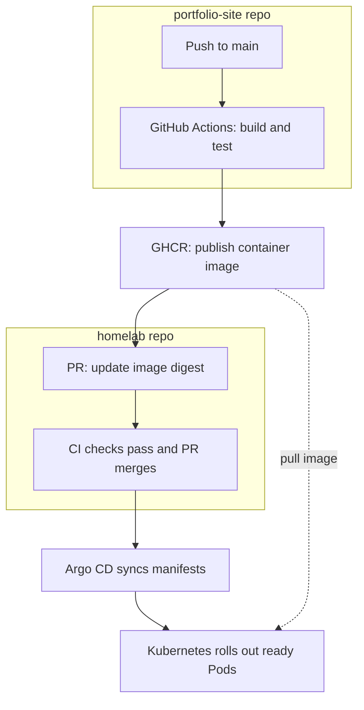
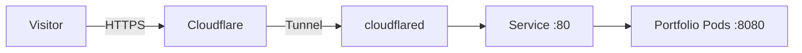

# Homelab

A three-node Kubernetes homelab for learning infrastructure automation, networking, monitoring, and reliable application deployment. Host configuration is managed with Ansible; Kubernetes manifests are kept alongside it in Git.

<p align="center">
  
</p>

## Current state

- Three Ubuntu Server nodes running a kubeadm Kubernetes cluster with containerd and Flannel.
- Ansible manages host preparation, runtime configuration, and the node01 dashboard display; GitHub Actions validates Ansible changes.
- SSH key authentication and Tailscale provide remote administration.
- Portfolio publicly available at **[tolgabilgis.com](https://tolgabilgis.com)** through Cloudflare Tunnel and HTTPS.
- Portfolio and cloudflared Deployments each configured with two replicas and image digests.
- GitHub Actions builds and tests portfolio images, publishes to GHCR, and opens deployment PRs that auto-merge after required checks.
- Argo CD automatically reconciles `kubernetes/apps` from `main`, with pruning and self-healing enabled.
- Prometheus, Grafana, and Alertmanager deployed through kube-prometheus-stack, with local-path persistent storage configured.
- Grafana dashboard displayed in kiosk mode on node01's attached monitor.

Status reflects configuration and setup checks, not continuous health monitoring.

## Hardware and node roles

Each Lenovo ThinkCentre mini PC has four logical CPUs, approximately 8 GB RAM, and a 256 GB SSD. Nodes connect through a Gigabit Ethernet switch.

| Node | LAN address | Role |
| --- | --- | --- |
| node01 | 192.168.1.201 | Kubernetes control plane, application workloads, and Ansible control node |
| node02 | 192.168.1.202 | Kubernetes worker |
| node03 | 192.168.1.203 | Kubernetes worker |

The control-plane scheduling taint was removed so all three nodes can run application workloads. The cluster still has only one control-plane node; application replicas do not make the control plane highly available.

Versions observed during setup:

| Component | Version |
| --- | --- |
| Ubuntu Server | 24.04.5 LTS |
| Kubernetes | v1.36.4 |
| containerd | 2.2.1 |
| Flannel image in committed manifest | v0.28.9 |
| Helm | v4.3.0 |
| kube-prometheus-stack chart | 91.4.1 |

## Network and remote access

| Setting | Value |
| --- | --- |
| Home LAN | 192.168.1.0/24 |
| Router and IPv4 DNS | 192.168.1.254 |
| Ethernet interface | eno1 |
| Kubernetes API | 192.168.1.201:6443 |
| Pod network | 10.244.0.0/16 |
| Service network | 10.96.0.0/12 |
| Demo website | http://192.168.1.201:30080 |
| Portfolio on LAN | http://192.168.1.201:30081 |
| Public portfolio | https://tolgabilgis.com |

Stable LAN addresses are assigned using router DHCP reservations. Ubuntu remains a DHCP client; its DHCP identifier was set to the interface MAC address so the router could reserve addresses consistently.

Nodes on the same LAN communicate through the switch. Flannel uses VXLAN for pod networking and explicitly selects `eno1` with `--iface=eno1`. Tailscale provides remote administration access; cluster communication uses the LAN addresses.

SSH keys and client aliases allow connections such as `ssh node01`. Aliases are configured on the client and are not cluster-wide DNS records.

Public requests reach Cloudflare over HTTPS, travel through the encrypted tunnel to a cloudflared Pod, then reach `portfolio-site:80` in the `portfolio` namespace. The Service forwards traffic to Nginx on container port 8080. The tunnel uses outbound connections, so this public access does not require router port forwarding.

The tunnel token is supplied through the `cloudflared-token` Kubernetes Secret, created separately from Git. Cloudflare hostname routes, DNS, and HTTPS settings are configured in the Cloudflare dashboard.

## Repository guide

| Path | Purpose |
| --- | --- |
| [ansible/inventory.ini](ansible/inventory.ini) | Hosts, connection settings, and Ansible user |
| [ansible/baseline.yml](ansible/baseline.yml) | Base operating-system maintenance and tools |
| [ansible/passwordless-sudo.yml](ansible/passwordless-sudo.yml) | Sudo configuration for administration |
| [ansible/kubernetes-prep.yml](ansible/kubernetes-prep.yml) | Disable swap, enable forwarding, and load br_netfilter |
| [ansible/containerd.yml](ansible/containerd.yml) | Configure containerd and systemd cgroups |
| [ansible/kubernetes-install.yml](ansible/kubernetes-install.yml) | Install Kubernetes tools and hold package upgrades |
| [kubernetes/kubeadm-init.yml](kubernetes/kubeadm-init.yml) | Control-plane initialization settings |
| [kubernetes/networking/kube-flannel.yml](kubernetes/networking/kube-flannel.yml) | Flannel networking resources |
| [kubernetes/demo-web.yml](kubernetes/demo-web.yml) | Nginx Deployment and NodePort Service |
| [kubernetes/monitoring/values.yml](kubernetes/monitoring/values.yml) | Monitoring retention and resource settings |
| [ansible/dashboard-display.yml](ansible/dashboard-display.yml) | Local Grafana kiosk display on node01 |
| [kubernetes/storage/local-path-storage.yml](kubernetes/storage/local-path-storage.yml) | Node-local persistent-volume provisioner |
| [kubernetes/apps/portfolio-site.yml](kubernetes/apps/portfolio-site.yml) | Portfolio namespace, Deployment, and Service |
| [kubernetes/apps/cloudflared.yml](kubernetes/apps/cloudflared.yml) | Cloudflare Tunnel connectors |
| [kubernetes/argocd/portfolio-site.yml](kubernetes/argocd/portfolio-site.yml) | Argo CD Application and scoped AppProject |
| [.github/workflows/ci.yml](.github/workflows/ci.yml) | Ansible validation workflow |

The inventory uses a local connection for node01, so the current playbooks are intended to run from node01. The other two nodes are managed over SSH.

## Completed setup milestones

1. **Operating systems and access:** installed Ubuntu Server, enabled SSH, configured SSH keys and stable addresses, and tested Tailscale access.
2. **Host automation:** configured Ansible inventory, baseline maintenance, and passwordless sudo.
3. **Continuous integration:** added GitHub Actions checks on pushes, pull requests, and manual runs.
4. **Kubernetes preparation:** disabled swap persistently, enabled IPv4 forwarding, loaded `br_netfilter` immediately and at boot, and configured containerd with systemd cgroups.
5. **Cluster bootstrap:** initialized node01 with kubeadm, installed Flannel, and joined node02 and node03 as workers.
6. **First workload:** deployed two Nginx replicas, observed one on each worker, accessed the website through node01's NodePort, and verified replacement of a deleted pod.

7. **Monitoring and display:** deployed the monitoring stack, configured local-path persistence, and set up a Grafana kiosk on node01.
8. **Application delivery:** containerized the portfolio, added image tests and publishing, and connected automated deployment PRs to Argo CD.
9. **Public access:** connected Cloudflare Tunnel and verified the portfolio through the custom domain with HTTPS.

The portfolio uses readiness and liveness probes, resource requests and limits, a non-root container, and a read-only root filesystem. Rolling updates allow one extra Pod with no unavailable replicas. Topology spreading uses `ScheduleAnyway` and groups Pods by revision: separate nodes are preferred, but placement remains flexible when fewer nodes are available.

## Routine commands

Run these from node01.

Check Ansible connectivity:

```bash
cd ~/homelab/ansible
ansible homelab -i inventory.ini -m ansible.builtin.ping
```

Inspect cluster health and workload placement:

```bash
kubectl get nodes -o wide
kubectl get pods -A
kubectl get pods -n portfolio -o wide
kubectl get applications -n argocd
```

Validate and apply the demo configuration:

```bash
cd ~/homelab
kubectl apply --dry-run=server -f kubernetes/demo-web.yml
kubectl apply -f kubernetes/demo-web.yml
kubectl rollout status deployment/demo-web --timeout=180s
```

Check Flannel:

```bash
kubectl rollout status daemonset/kube-flannel-ds -n kube-flannel --timeout=180s
```

View application logs:

```bash
kubectl logs -n portfolio -l app.kubernetes.io/name=portfolio-site --tail=50 --prefix
kubectl logs -n portfolio -l app.kubernetes.io/name=cloudflared --tail=50 --prefix
```

## Monitoring

Helm release `monitoring` is installed in namespace `monitoring`. Grafana browser access and the Kubernetes dashboard have been tested. Alert delivery and coverage of failure scenarios still need verification.

The committed values configure Prometheus for seven-day retention and a default 30-second scrape interval, with resource requests and limits for Prometheus, Grafana, and Alertmanager.

The values configure local-path persistent volumes for Prometheus (20Gi), Grafana (2Gi), and Alertmanager (2Gi). These preserve data across Pod replacement on the same node, but do not replicate it to other nodes or replace backups. If the storage node is unavailable, the affected workload cannot simply recover its data on another node.

To install or update from node01 with Helm 4:

```bash
cd ~/homelab
helm repo add prometheus-community https://prometheus-community.github.io/helm-charts
helm repo update
helm upgrade --install monitoring prometheus-community/kube-prometheus-stack \
  --version 91.4.1 --namespace monitoring --create-namespace \
  --values kubernetes/monitoring/values.yml \
  --wait --timeout 10m --rollback-on-failure
```

Check the release and pods:

```bash
helm list -n monitoring
kubectl get pods -n monitoring -o wide
```

For temporary Grafana access, keep this command running on node01:

```bash
kubectl port-forward -n monitoring service/monitoring-grafana 3000:80
```

In a terminal on the desktop, keep an SSH tunnel open:

```bash
ssh -N -L 3000:127.0.0.1:3000 node01
```

Open http://localhost:3000 on the desktop. Use the Grafana account; do not store its password in Git. These forwarding sessions are temporary and must be restarted after they end.

The [dashboard display playbook](ansible/dashboard-display.yml) configures a dedicated local user, LightDM/Openbox, Chromium kiosk mode, and a local Grafana port-forward service on node01. It opens the Kubernetes Dashboard by Chever. Grafana allows anonymous Viewer access in the committed values; administration remains authenticated. Grafana is not published through the portfolio tunnel.

## Git and CI workflow

Edit configuration, validate it, commit, and push. GitHub Actions runs a syntax check for `ansible/baseline.yml` and `ansible-lint ansible/` on a GitHub-hosted runner.

This repository's CI validates Ansible; Kubernetes manifest validation is still a planned addition. Argo CD handles delivery for `kubernetes/apps`; host playbooks, monitoring Helm upgrades, and cluster bootstrap remain separate operations.

## Delivery pipeline



### Website traffic



Source and build workflow: [TolgaBilgis/portfolio-site](https://github.com/TolgaBilgis/portfolio-site).

Argo CD reads Git independently of the local checkout. Make lasting application changes in this repository and merge them into `main`; self-healing can undo direct edits to managed resources. Pruning removes managed resources deleted from Git. To roll back a portfolio release, revert its deployment digest change through a PR and let Argo CD reconcile it.

The Argo CD Application and AppProject are committed, but the Argo CD installation, repository credentials, and tunnel Secret must be bootstrapped separately. Credentials and dashboard-side Cloudflare settings are not recreated by the application manifests.

After a README update made directly on GitHub, bring the change into the node01 checkout before further work:

```bash
cd ~/homelab
git pull --ff-only
```

Keep SSH private keys, kubeconfig/admin.conf, passwords, Tailscale authentication keys, and kubeadm join tokens out of Git. The local Kubernetes administrator configuration stays in `~/.kube/config`.

## Next milestones

- [x] Install and verify Helm.
- [x] Deploy Prometheus and Grafana with settings sized for the available hardware.
- [x] Configure local-path persistent storage for monitoring.
- [ ] Implement and test backups and restores.
- [ ] Back up and migrate Grafana, Prometheus, and Alertmanager local-path data to node01, then pin those monitoring workloads to node01 so either worker can be powered down without losing the dashboard.
- [ ] Later convert the cluster to three control-plane nodes and replace local-path storage with replicated storage such as Longhorn for true node-failure recovery.
- [ ] Add alerts and test failure scenarios.
- [ ] Extend CI to validate Kubernetes configuration.
- [x] Add automated portfolio deployment from Git with Argo CD.
- [x] Publish the portfolio through Cloudflare Tunnel and a custom HTTPS domain.
- [x] Configure a Grafana kiosk display on node01.

Update this README after each verified milestone with the configuration, its purpose, and how it was tested. Keep planned work separate from completed work.
